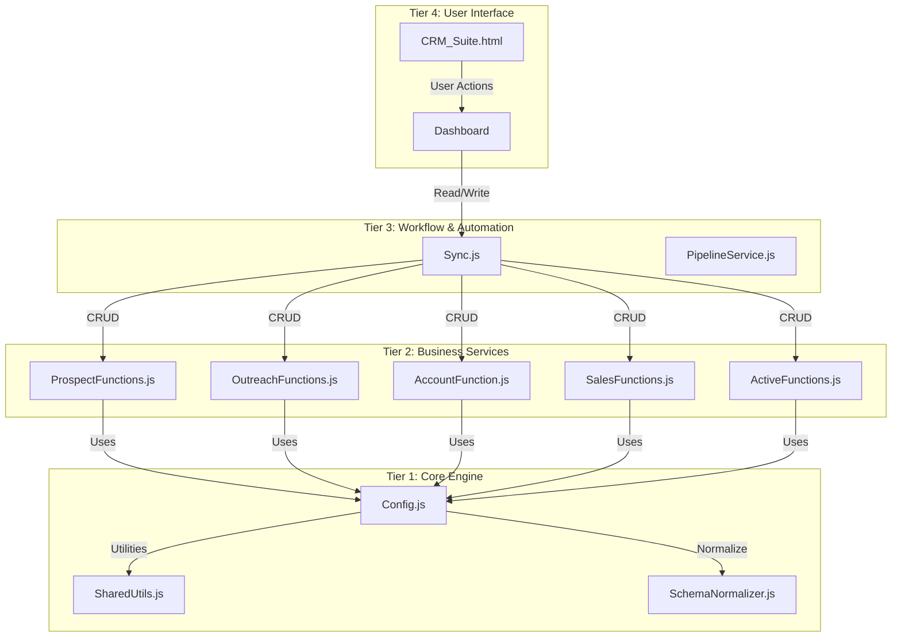

# CRM Integration Plan: Sales, Contacts, System_Schema, and Active Sheets

## Executive Summary

This document outlines the integration plan for adding four new data entities to the K&L Recycling CRM system:
- **Sales** (NEW) - Sales/purchase transactions
- **Contacts** (EXISTING in schema, needs data sync)
- **System_Schema** (EXISTING - update with new entities)
- **Active** (NEW) - Active deployed containers/assets

## Current System State

### Existing Entities
| Entity | Primary Key | Status |
|--------|------------|--------|
| Prospects | Company ID | ✓ Active |
| Outreach | Outreach ID | ✓ Active |
| Accounts | (Auto) | ✓ Active |
| Contacts | (Name) | ✓ Defined in schema |

### New Entities to Add
| Entity | Primary Key | Foreign Key | Notes |
|--------|-------------|------------|-------|
| Sales | Sales ID | Company | NEW - tracks purchases |
| Active | Company ID | Company ID | NEW - tracks containers |

---

## Data Structure Analysis

### 1. Sales.csv Structure
**Headers:** Date, Company, Material, Weight, Price, [empty], Date Range, Name/Company, Material, Weight(s), Payment Amount

**Proposed Schema:**
```javascript
{
  salesId: { header: 'Sales ID', type: 'string', required: true },
  date: { header: 'Date', type: 'date', required: true },
  company: { header: 'Company', type: 'string', required: true },
  companyId: { header: 'Company ID', type: 'string', required: false }, // FK to Prospects
  material: { header: 'Material', type: 'string', required: true },
  weight: { header: 'Weight', type: 'number', required: true },
  price: { header: 'Price', type: 'number', required: true },
  dateRange: { header: 'Date Range', type: 'string', required: false },
  supplierName: { header: 'Supplier Name', type: 'string', required: false },
  materialType: { header: 'Material Type', type: 'string', required: false },
  weightAdjusted: { header: 'Weight Adjusted', type: 'number', required: false },
  paymentAmount: { header: 'Payment Amount', type: 'number', required: false }
}
```

### 2. Active.csv Structure
**Headers:** Company ID, Company Name, Location Name, Location Address, Column 8, Zip Code, Current Deployed Asset(s), Container Size

**Proposed Schema:**
```javascript
{
  companyId: { header: 'Company ID', type: 'string', required: true }, // PK + FK
  companyName: { header: 'Company Name', type: 'string', required: true },
  locationName: { header: 'Location Name', type: 'string', required: false },
  locationAddress: { header: 'Location Address', type: 'string', required: false },
  locationCity: { header: 'Location City', type: 'string', required: false },
  zipCode: { header: 'Zip Code', type: 'string', required: false },
  deployedAssets: { header: 'Current Deployed Assets', type: 'string', required: false },
  containerSize: { header: 'Container Size', type: 'string', required: false }
}
```

### 3. Contacts.csv Structure
**Already in schema - columns:** Name, Company, Account, Role, Department, Phone Number, Email, Address

**Action:** Verify alignment with system-schema.json and Config.js

### 4. System_Schema.csv
**Action:** Add entries for Sales and Active entities

---

## Integration Architecture

### Mermaid: Data Flow Diagram



---

## Implementation Steps

### Phase 1: Configuration Updates

#### Step 2a: Update Config.js
- [ ] Add `SALES: 'Sales'` to CONFIG.SHEETS
- [ ] Add `ACTIVE: 'Active'` to CONFIG.SHEETS  
- [ ] Add SALES header array to CONFIG.HEADERS
- [ ] Add ACTIVE header array to CONFIG.HEADERS
- [ ] Add SALES schema to CONFIG.SCHEMA
- [ ] Add ACTIVE schema to CONFIG.SCHEMA

#### Step 2b: Update system-schema.json
- [ ] Add "Sales" object with fields array
- [ ] Add "Active" object with fields array
- [ ] Update version number

#### Step 2c: Update System_Schema.csv
- [ ] Add Sales field definitions
- [ ] Add Active field definitions

#### Step 2d: Update Settings.csv
- [ ] Add validation lists for new entities if needed

---

### Phase 2: Business Logic

#### Step 3a: Create SalesFunctions.js
**Tier 2: Business Services**

Functions to implement:
- `getSales()` - Retrieve all sales
- `getSalesById(salesId)` - Get single sale
- `getSalesByCompany(companyId)` - Get sales by company
- `createSale(saleData)` - Create new sale
- `updateSale(salesId, saleData)` - Update sale
- `deleteSale(salesId)` - Delete sale
- `importSalesFromCSV()` - Bulk import

**Batch Operations Required:** Use getValues/setValues

**Status:** IN PROGRESS

#### Step 3b: Create ActiveFunctions.js
**Tier 2: Business Services**

Functions to implement:
- `getActiveAccounts()` - Retrieve all active accounts
- `getActiveById(companyId)` - Get single active account
- `getActiveByCompany(companyId)` - Get by company
- `createActiveAccount(activeData)` - Create new
- `updateActiveAccount(companyId, activeData)` - Update
- `deleteActiveAccount(companyId)` - Delete
- `linkActiveToProspect(companyId)` - Link to Prospects

#### Step 3c: Contacts Integration
- [ ] Verify existing ContactFunctions or create if needed
- [ ] Add sync functionality

#### Step 3d: Update SchemaNormalizer.js
- [ ] Add SALES schema mappings
- [ ] Add ACTIVE schema mappings

#### Step 3e: Update SharedUtils.js
- [ ] Add generateSalesId() function if needed

#### Step 3f: Update Sync.js
- [ ] Add sync functions for Sales
- [ ] Add sync functions for Active
- [ ] Add workflow triggers

---

### Phase 3: UI Updates (Optional)

#### Step 4: Dashboard Integration
- [ ] Add Sales tab to Dashboard
- [ ] Add Active containers view
- [ ] Update CRM_Suite.html if needed

---

### Phase 4: Testing

#### Step 5: Verification
- [ ] Test CRUD operations for Sales
- [ ] Test CRUD operations for Active
- [ ] Test data import from CSV
- [ ] Verify workflow integration
- [ ] Test error handling

---

## Risk Assessment

| Risk | Impact | Mitigation |
|------|--------|------------|
| Duplicate Company IDs in Active | High | Validate FK before insert |
| Sales data without Company | Medium | Allow nullable, flag for review |
| Import performance | Medium | Use batch operations |
| Schema mismatch | High | Validate headers before import |

---

## References

- Config.js pattern: Use existing SHEETS, HEADERS, SCHEMA structure
- Batch operations: Always use getValues/setValues
- Return format: `{ success: true/false, data: result, error: message }`
- ID generation: Use SharedUtils.generateUniqueId()